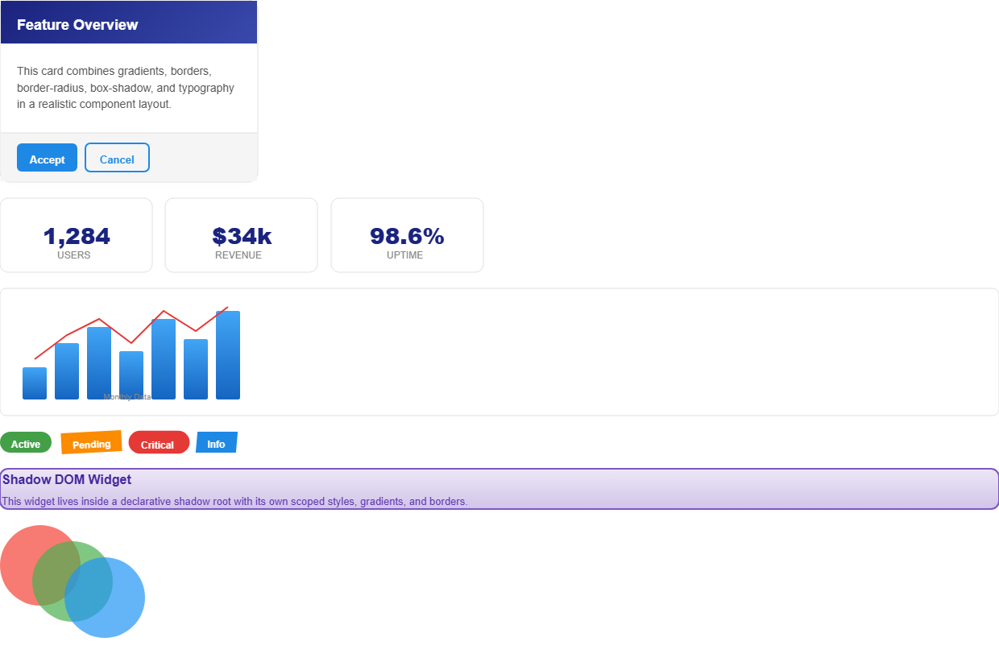
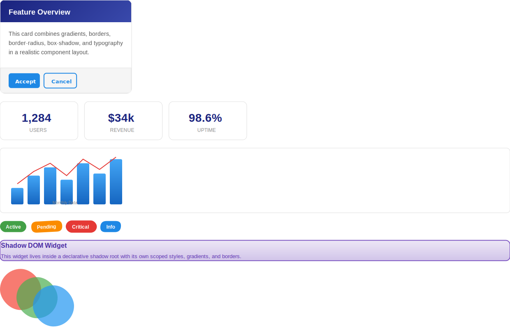

# Sample Output Gallery

This directory contains generated demo artifacts for the sample HTML inputs in [../demos](../demos).

GitHub does not render repository HTML files as live pages, so each demo is linked in three ways:

- HTML source file in the repo
- PNG preview of the HTML rendering
- DXF, PDF, PNG, and SVG output files with preview images

Regenerate the artifacts with:

```bash
npm run test:demos
```

## Demos

| Demo | HTML | HTML Preview | DXF | PDF | PDF Preview | PNG | SVG |
|---|---|---|---|---|---|---|---|
| BG Image Transform | [bg-image-transform.html](./bg-image-transform.html) | [bg-image-transform-html-preview.png](./bg-image-transform-html-preview.png) | [bg-image-transform.dxf](./bg-image-transform.dxf) | [bg-image-transform.pdf](./bg-image-transform.pdf) | [bg-image-transform-pdf-preview.png](./bg-image-transform-pdf-preview.png) | [bg-image-transform.png](./bg-image-transform.png) | [bg-image-transform.svg](./bg-image-transform.svg) |
| Borders | [borders.html](./borders.html) | [borders-html-preview.png](./borders-html-preview.png) | [borders.dxf](./borders.dxf) | [borders.pdf](./borders.pdf) | [borders-pdf-preview.png](./borders-pdf-preview.png) | [borders.png](./borders.png) | [borders.svg](./borders.svg) |
| Comprehensive | [comprehensive.html](./comprehensive.html) | [comprehensive-html-preview.png](./comprehensive-html-preview.png) | [comprehensive.dxf](./comprehensive.dxf) | [comprehensive.pdf](./comprehensive.pdf) | [comprehensive-pdf-preview.png](./comprehensive-pdf-preview.png) | [comprehensive.png](./comprehensive.png) | [comprehensive.svg](./comprehensive.svg) |
| Gradients | [gradients.html](./gradients.html) | [gradients-html-preview.png](./gradients-html-preview.png) | [gradients.dxf](./gradients.dxf) | [gradients.pdf](./gradients.pdf) | [gradients-pdf-preview.png](./gradients-pdf-preview.png) | [gradients.png](./gradients.png) | [gradients.svg](./gradients.svg) |
| Images | [images.html](./images.html) | [images-html-preview.png](./images-html-preview.png) | [images.dxf](./images.dxf) | [images.pdf](./images.pdf) | [images-pdf-preview.png](./images-pdf-preview.png) | [images.png](./images.png) | [images.svg](./images.svg) |
| Layouts | [layouts.html](./layouts.html) | [layouts-html-preview.png](./layouts-html-preview.png) | [layouts.dxf](./layouts.dxf) | [layouts.pdf](./layouts.pdf) | [layouts-pdf-preview.png](./layouts-pdf-preview.png) | [layouts.png](./layouts.png) | [layouts.svg](./layouts.svg) |
| Places | [places.html](./places.html) | [places-html-preview.png](./places-html-preview.png) | [places.dxf](./places.dxf) | [places.pdf](./places.pdf) | [places-pdf-preview.png](./places-pdf-preview.png) | [places.png](./places.png) | [places.svg](./places.svg) |
| Shadow DOM | [shadow-dom.html](./shadow-dom.html) | [shadow-dom-html-preview.png](./shadow-dom-html-preview.png) | [shadow-dom.dxf](./shadow-dom.dxf) | [shadow-dom.pdf](./shadow-dom.pdf) | [shadow-dom-pdf-preview.png](./shadow-dom-pdf-preview.png) | [shadow-dom.png](./shadow-dom.png) | [shadow-dom.svg](./shadow-dom.svg) |
| Stacking | [stacking.html](./stacking.html) | [stacking-html-preview.png](./stacking-html-preview.png) | [stacking.dxf](./stacking.dxf) | [stacking.pdf](./stacking.pdf) | [stacking-pdf-preview.png](./stacking-pdf-preview.png) | [stacking.png](./stacking.png) | [stacking.svg](./stacking.svg) |
| SVG | [svg.html](./svg.html) | [svg-html-preview.png](./svg-html-preview.png) | [svg.dxf](./svg.dxf) | [svg.pdf](./svg.pdf) | [svg-pdf-preview.png](./svg-pdf-preview.png) | [svg.png](./svg.png) | [svg.svg](./svg.svg) |
| SVG Files | [svg-files.html](./svg-files.html) | [svg-files-html-preview.png](./svg-files-html-preview.png) | [svg-files.dxf](./svg-files.dxf) | [svg-files.pdf](./svg-files.pdf) | [svg-files-pdf-preview.png](./svg-files-pdf-preview.png) | [svg-files.png](./svg-files.png) | [svg-files.svg](./svg-files.svg) |
| SVG Markers | [svg-markers.html](./svg-markers.html) | [svg-markers-html-preview.png](./svg-markers-html-preview.png) | [svg-markers.dxf](./svg-markers.dxf) | [svg-markers.pdf](./svg-markers.pdf) | [svg-markers-pdf-preview.png](./svg-markers-pdf-preview.png) | [svg-markers.png](./svg-markers.png) | [svg-markers.svg](./svg-markers.svg) |
| Test 2 | [test2.html](./test2.html) | [test2-html-preview.png](./test2-html-preview.png) | [test2.dxf](./test2.dxf) | [test2.pdf](./test2.pdf) | [test2-pdf-preview.png](./test2-pdf-preview.png) | [test2.png](./test2.png) | [test2.svg](./test2.svg) |
| Test 3 | [test3.html](./test3.html) | [test3-html-preview.png](./test3-html-preview.png) | [test3.dxf](./test3.dxf) | [test3.pdf](./test3.pdf) | [test3-pdf-preview.png](./test3-pdf-preview.png) | [test3.png](./test3.png) | [test3.svg](./test3.svg) |
| Text | [text.html](./text.html) | [text-html-preview.png](./text-html-preview.png) | [text.dxf](./text.dxf) | [text.pdf](./text.pdf) | [text-pdf-preview.png](./text-pdf-preview.png) | [text.png](./text.png) | [text.svg](./text.svg) |
| Transforms | [transforms.html](./transforms.html) | [transforms-html-preview.png](./transforms-html-preview.png) | [transforms.dxf](./transforms.dxf) | [transforms.pdf](./transforms.pdf) | [transforms-pdf-preview.png](./transforms-pdf-preview.png) | [transforms.png](./transforms.png) | [transforms.svg](./transforms.svg) |
| Typography | [typography.html](./typography.html) | [typography-html-preview.png](./typography-html-preview.png) | [typography.dxf](./typography.dxf) | [typography.pdf](./typography.pdf) | [typography-pdf-preview.png](./typography-pdf-preview.png) | [typography.png](./typography.png) | [typography.svg](./typography.svg) |

## Quick Preview

### Comprehensive HTML

[](./comprehensive.html)

### Comprehensive PNG Output

[](./comprehensive.png)

### Comprehensive SVG Output

[](./comprehensive.svg)

### Comprehensive PDF

[](./comprehensive.pdf)